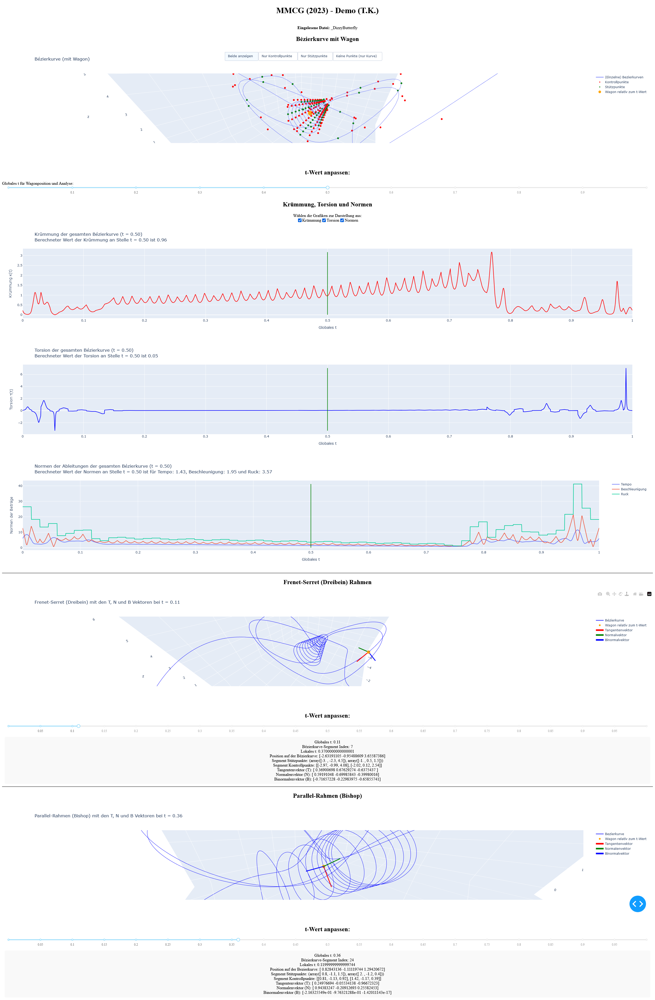

# rc-becier
A bezier curve-based roller coaster to visualize and ride roller coaster tracks using plain mathematics methods (differential geometry) of Bezier curves.

## Installation
To install the required dependencies, run the following commands:

```bash
pip install numpy dash plotly
```

Then simply run it:

```bash
python rc-becier.py
```

## Preview

